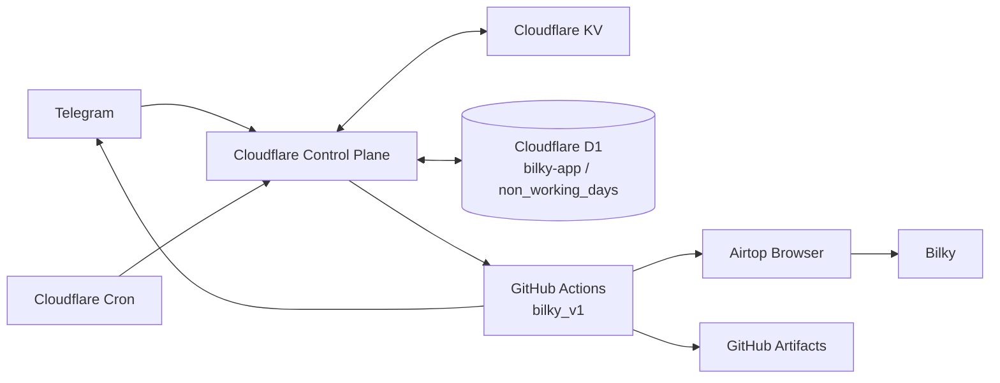
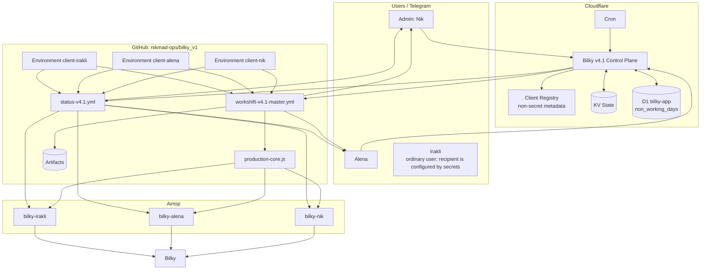
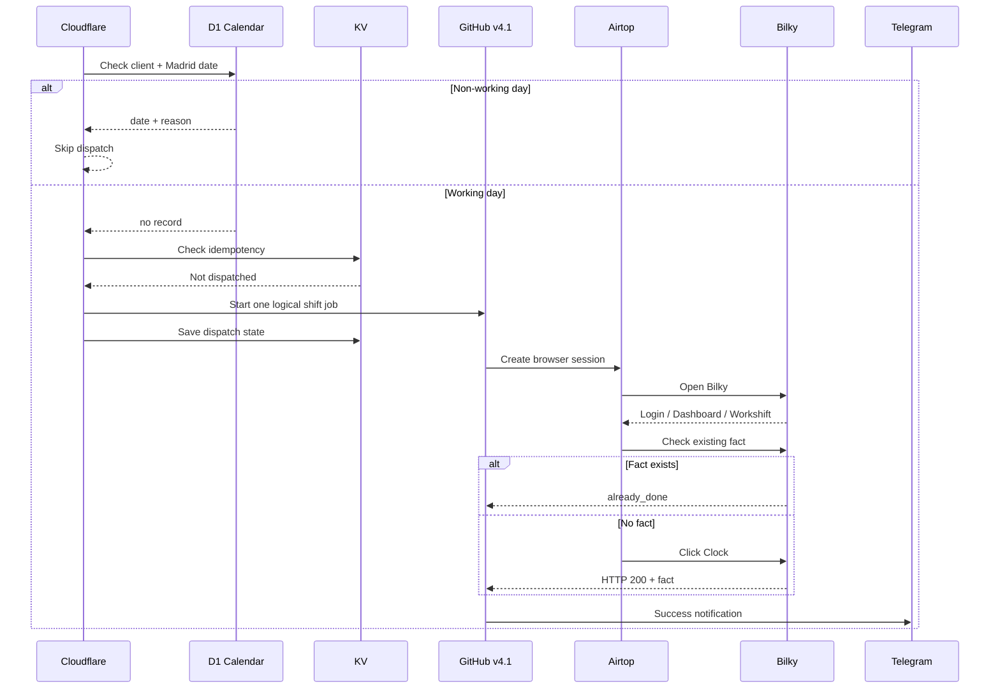
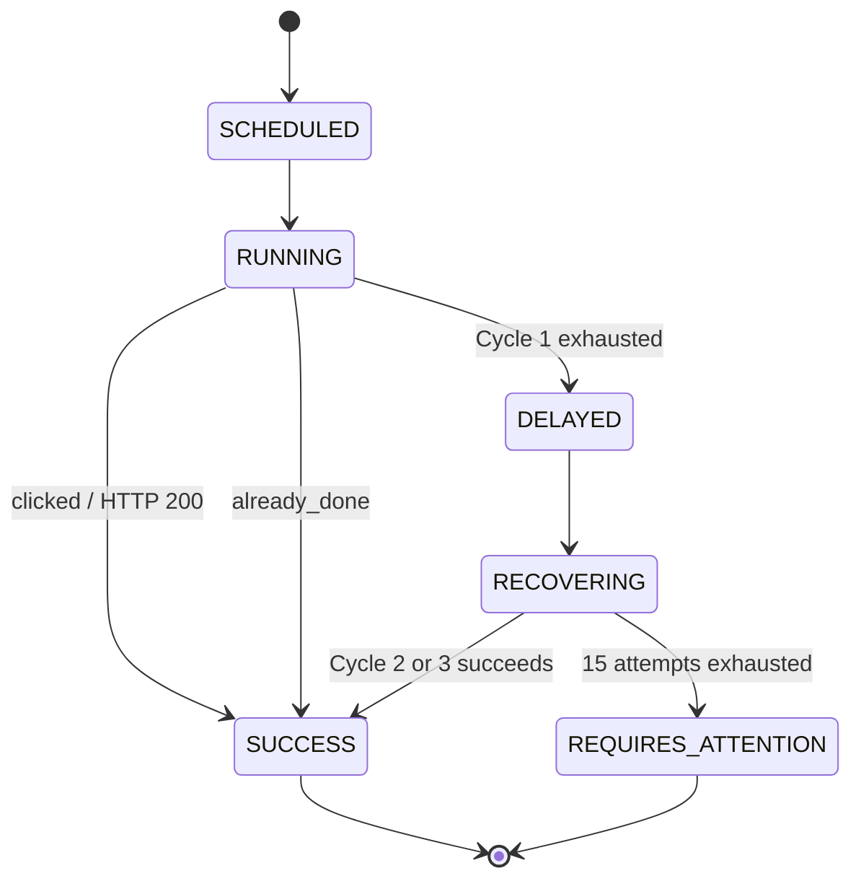

# Bilky Automation v4.1 — Multi-user Architecture & Technical Specification

**Статус:** Target architecture / рабочее ТЗ  
**Версия:** 4.1  
**Последнее обновление:** 08.10.2026 — operational calendar / Cloudflare D1  
**Язык документа:** русский  
**Исходный репозиторий:** `nikmad-ops/bilky_v1`  
**Назначение:** описание целевой multi-user архитектуры Bilky Automation простым языком, чтобы новый участник команды, включая стажёра без опыта DevOps, мог понять систему, безопасно работать с ней и развивать её.

> Этот документ описывает целевую архитектуру v4.1. Он не является описанием legacy-архитектуры. По состоянию на 08.10.2026 Nik, Alena и Irakli переведены на общий v4.1 Control Plane и общий GitHub execution layer.

---

## 1. Для кого этот документ

Документ рассчитан на человека, который:

- умеет пользоваться GitHub на базовом уровне;
- может читать простой JavaScript, YAML и логи, но не обязан быть DevOps-инженером;
- раньше не работал с Cloudflare Workers, GitHub Actions, Airtop, KV и browser automation;
- должен понять не только **что делает код**, но и **зачем архитектура устроена именно так**.

Главная задача документа — убрать зависимость от знаний «в голове» одного человека. После чтения стажёр должен понимать:

1. что такое Bilky Automation;
2. какие сервисы участвуют в работе;
3. кто за что отвечает;
4. как проходит обычный Morning/Evening;
5. что происходит при сбоях;
6. где смотреть логи;
7. какие изменения безопасны, а какие опасны;
8. как система должна масштабироваться с 3 пользователей до десятков и затем до 100+.


### Текущее production-состояние

- Nik, Alena и Irakli работают через v4.1;
- каждому пользователю соответствует отдельный GitHub Environment и Airtop profile;
- legacy scheduled dispatch для всех трёх отключён;
- operational non-working days хранятся в Cloudflare D1 `bilky-app`, таблица `non_working_days`;
- scheduler проверяет non-working day до создания GitHub/Airtop job;
- Status использует те же данные D1 и показывает такой день как non-working;
- Irakli не имеет отдельного Telegram interface; его пользовательские уведомления маршрутизируются через конфигурацию Alena.

---

## 2. Глоссарий

### Bilky
Внешняя система учёта рабочего времени. Именно в Bilky нужно зарегистрировать Morning или Evening.

**В нашем проекте:** это целевая система, в которой автоматизация реально нажимает Clock и получает фактическое время регистрации.

### Morning / Evening
Два бизнес-действия:

- **Morning** — начало рабочего дня;
- **Evening** — конец рабочего дня.

### Clock
Кнопка в Bilky, которая создаёт фактическую регистрацию времени.

**Важно:** нажатие считается подтверждённым только если Bilky вернул успешный HTTP 200 и/или на странице появился факт времени.

### Fact
Фактическое время, записанное Bilky, например `08:29:41`.

Пользователю обычно показываем только часы и минуты: `08:29`.

### Control Plane
«Диспетчер» системы. Он сам не нажимает кнопку в Bilky. Он решает:

- кого запускать;
- когда запускать;
- Morning или Evening;
- разрешён ли ручной запуск;
- не был ли такой запуск уже создан.

**В нашем случае:** Control Plane реализуется в Cloudflare Worker.

### Cloudflare Worker
Небольшая серверная программа, работающая в инфраструктуре Cloudflare.

**В нашем случае:** принимает cron-события, Telegram-команды и создаёт GitHub workflow runs.

### Cron
Расписание, которое периодически запускает Worker.

**В нашем случае:** Worker проверяет, нужно ли создать Morning/Evening job для конкретного пользователя.

### GitHub Actions
Сервис GitHub для запуска автоматических задач.

**В нашем случае:** GitHub Actions является главным execution engine — именно там живёт логика одного Morning/Evening job, retries, анализ результата, Telegram notification и diagnostics.

### Workflow
YAML-файл GitHub Actions, который описывает последовательность шагов.

**В нашем случае:** основной workflow v4.1 выполняет один логический Morning или Evening для одного пользователя.

### Job
Один логический запуск задачи.

Пример:

> Nik + 05.10.2026 + Morning = один job.

Job может содержать много попыток, но это всё равно одна бизнес-операция.

### Attempt
Одна попытка открыть Airtop, войти в Bilky и получить требуемый результат.

**В v4.1:** один Cycle содержит максимум 5 attempts.

### Cycle
Группа из максимум 5 попыток.

**В v4.1:** максимум 3 cycles, то есть максимум 15 attempts на один Morning/Evening job.

### Recovery
Автоматическое продолжение работы после временной проблемы.

Например: первые 5 попыток не прошли, но система не сдаётся, а начинает Cycle 2.

### Terminal state
Финальное состояние job, после которого система больше ничего не делает.

Основные terminal states:

- `SUCCESS`;
- `ALREADY_DONE`;
- `REQUIRES_ATTENTION` после исчерпания всех 15 попыток.

### Idempotency
Защита от повторного создания одной и той же операции.

Простой пример: scheduler работает каждые 5 минут, но Morning для Nik за одну дату должен быть создан только один раз.

### Duplicate protection
Защита от повторного нажатия Clock.

Перед каждым нажатием система проверяет, нет ли уже фактического времени. Если есть — возвращает `already_done` и ничего не нажимает.

### Airtop
Сервис удалённого браузера.

**В нашем случае:** Airtop создаёт browser session с ES proxy, через которую Playwright открывает Bilky.

### Airtop profile
Постоянный профиль браузера.

**В нашем случае:** отдельный профиль на каждого пользователя, например `bilky-nik`, `bilky-alena`, `bilky-irakli`.

### Airtop API key
Секретный ключ доступа к Airtop.

**В нашем случае:** отдельный ключ на каждого пользователя.

### Playwright
Библиотека для управления браузером программно.

**В нашем случае:** Playwright подключается к браузеру Airtop и работает с Bilky DOM.

### DOM
Структура HTML-страницы, которую видит браузер.

**В нашем случае:** мы ищем структурные элементы страницы Bilky: login fields, Workshift link, date container, Clock button, фактическое время.

### Selector
Правило поиска элемента в DOM.

Пример: `#password` — поле пароля.

### Dashboard detection
Определение, что Bilky уже успешно авторизовал пользователя и открыл Dashboard.

**Важно:** нельзя полагаться только на визуальную видимость меню. В реальном DOM audit мы подтвердили, что Workshift link может существовать в DOM, но быть скрытым.

### HTTP 200
Код успешного HTTP-ответа.

**В нашем случае:** ответ `clock-hour HTTP 200` является сильным доказательством, что Bilky принял нажатие Clock.

### CAPTCHA / Cloudflare challenge
Защитная проверка сайта.

**Ключевое правило Bilky:** мы **не ждём CAPTCHA дольше**. Если конкретная Airtop session быстро не проходит challenge, попытка заканчивается, session закрывается, через 3 минуты создаётся новая session.

### Session budget
Максимальное полезное время одной Airtop browser session.

**В нашем случае:** 28 секунд. Его нельзя увеличивать без отдельного решения, основанного на данных.

### Post-login timeout
Сколько ждём после отправки login form появления понятного состояния.

**В нашем случае:** 8 секунд.

### Retry
Повтор после неуспешной попытки.

**В нашем случае:** стандартный интервал между попытками — 3 минуты.

### KV
Cloudflare Key-Value storage.

**В нашем случае:** лёгкая память Control Plane: idempotency, состояние dispatch, request IDs и временные operational states.

**Важно:** KV не является календарём. Даты праздников/day off в KV не хранятся.

### D1
Cloudflare D1 — реляционная SQL-база данных Cloudflare.

**В нашем случае:** D1 `bilky-app` хранит operational calendar, то есть явные non-working dates по пользователям. Используется таблица `non_working_days`.

D1 и KV имеют разные роли:

- **D1** — business configuration: какие конкретные даты являются нерабочими для конкретного пользователя;
- **KV** — transient/control state: был ли dispatch, request ID, idempotency и временное состояние.

### Non-working day
Явно заданная нерабочая дата конкретного пользователя: официальный праздник, day off или другая дата, когда Bilky Morning/Evening запускать нельзя.

Ключевые правила:

- дата хранится как данные, а не в коде;
- запись относится к конкретному `user_id`;
- один пользователь может иметь выходной, а другой в ту же дату работать;
- календарь управляется администратором через D1 без изменения JavaScript/YAML и без redeploy;
- weekend остаётся отдельным общим правилом и не требует записей на каждую субботу/воскресенье.

### Secret
Конфиденциальное значение: пароль, NIF, API key, Telegram bot token, GitHub token.

**Правило:** секреты нельзя хранить в коде, KV как обычный текст, логах или diagnostics.

### GitHub Environment
Изолированная область GitHub, в которой можно хранить secrets и настройки конкретного пользователя.

**Целевое применение:** `client-nik`, `client-alena`, `client-irakli` с одинаковыми именами secrets.

### Artifact
Файл, который GitHub Actions сохраняет после run.

**В нашем случае:** diagnostics, run result, attempt history, forensic snapshot.

### Forensic
Диагностический снимок состояния страницы при непонятной ошибке.

**В нашем случае:** DOM fingerprint, безопасный HTML snapshot, ограниченная network metadata и screenshot без секретных данных.

### Runbook
Короткая инструкция «что делать, если что-то сломалось».

### ADR — Architecture Decision Record
Короткая запись, почему принято конкретное архитектурное решение.

Пример: почему session budget равен 28 секундам или почему retry живёт внутри одного GitHub run.

### Concurrency
Правило, которое не позволяет одновременно выполнять конфликтующие jobs.

**В нашем случае:** для одного пользователя и одного action одновременно должен работать только один v4.1 job.

---

## 3. Bilky за 60 секунд: что происходит в обычный день

Пример Morning для Nik в рабочий день.

1. Cloudflare Worker по расписанию видит, что наступило время Morning.
2. Worker определяет локальную дату `Europe/Madrid` и проверяет, что сегодня weekday.
3. До любого GitHub/Airtop dispatch Worker проверяет D1 `bilky-app.non_working_days` для пары `Nik + дата`.
4. Если запись существует, день считается non-working: Scheduled Morning/Evening не создаётся, GitHub Actions и Airtop вообще не запускаются.
5. Если дата рабочая, Worker проверяет KV idempotency: не создавался ли уже Morning job для Nik сегодня.
6. Если нет — Worker запускает GitHub workflow.
7. GitHub получает параметры: пользователь, Morning/Evening, Airtop profile, режим запуска.
8. GitHub создаёт Airtop browser session.
9. Airtop открывает Bilky через ES proxy.
10. Код проверяет: пользователь уже на Workshift, на Dashboard или на Login.
11. Если Bilky просит login — вводятся NIF и password.
12. После login система определяет Dashboard по URL и DOM.
13. Открывается Workshift.
14. Перед нажатием Clock проверяется, нет ли уже фактического времени.
15. Если факт уже есть — ничего не нажимаем и завершаем job как `already_done`.
16. Если факта нет — нажимаем Clock.
17. Ждём ответ Bilky.
18. При HTTP 200 читаем фактическое время.
19. GitHub отправляет Telegram success.
20. Job завершён.

Если browser attempt неуспешен, запускается recovery: новая Airtop session через 3 минуты.

Calendar check относится к **созданию job**, а не к recovery уже запущенного job. Уже начатый допустимый job продолжает recovery по своим правилам.

Status — отдельный read-only сценарий: он разрешён и в non-working day, получает календарь из D1 и показывает такой день как non-working.

## 4. Цели v4.1 Multi-user

v4.1 должна решить пять задач.

### 4.1 Один код для всех пользователей
Nik, Alena, Irakli и будущие пользователи должны использовать один production codebase и один master workflow.

Нельзя поддерживать три почти одинаковые копии кода.

### 4.2 Изоляция пользователей
Несмотря на общий код, у каждого пользователя должны быть отдельно:

- Bilky credentials;
- Airtop API key;
- Airtop profile;
- Telegram routing;
- state и idempotency keys;
- run history;
- operational non-working calendar entries.

### 4.3 Автоматическое восстановление
Один временный сбой не должен превращаться в пользовательское `ERROR`.

v4.1 должна самостоятельно пройти до 3 cycles × 5 attempts.

### 4.4 Понятное продуктовое поведение
Пользователь должен видеть:

- успех;
- спокойное сообщение о задержке;
- отсутствие технического мусора.

Технические детали остаются у admin и в diagnostics.

### 4.5 Подготовка к масштабированию
Архитектура должна без переписывания базовых принципов перейти от 3 пользователей к 10, 30 и 100+.

---

## 5. Архитектура верхнего уровня



Простыми словами:

- **Cloudflare Control Plane** решает, когда и кого запускать.
- **D1** хранит явные per-user non-working dates и проверяется до создания Morning/Evening job.
- **KV** хранит idempotency и временный dispatch state; календарь в KV не хранится.
- **GitHub Actions** выполняет бизнес-задачу и владеет recovery.
- **Airtop** предоставляет браузер.
- **Bilky** является системой назначения и source of truth для фактического времени.
- **Telegram** — интерфейс пользователя и администратора.
- **Artifacts** — техническая история и диагностика.

Главное разделение ответственности:

> D1 отвечает на вопрос «можно ли вообще запускать этого пользователя в эту дату?». KV отвечает на вопрос «не запускали ли мы уже эту операцию?».

## 6. Компоненты и ответственность

| Компонент | Продукт | Что делает | Чего делать не должен |
|---|---|---|---|
| Control Plane | Cloudflare Worker | Scheduler, Manual Run, Status dispatch, permissions, calendar check, idempotency | Не должен сам управлять браузером Bilky |
| Scheduler | Cloudflare Cron | Периодически проверяет weekday, operational window и создаёт допустимый job | Не должен делать retries отдельных browser attempts |
| Operational Calendar | Cloudflare D1 | Хранит явные per-user non-working dates и reason | Не хранит credentials, retry state или browser state |
| State | Cloudflare KV | Хранит dispatch/idempotency/temporary state | Не хранит Bilky password и не используется как календарь |
| Execution Engine | GitHub Actions | Выполняет один Morning/Evening job целиком | Не создаёт второй независимый job для того же действия |
| Browser Core | Node.js + Playwright | Login, DOM, Workshift, Clock, fact | Не решает расписание и календарь |
| Browser Provider | Airtop | Создаёт remote browser + ES proxy | Не определяет бизнес-успех |
| Target System | Bilky | Хранит реальный факт рабочего времени | Не является нашим control-state store |
| Notifications | Telegram | User/admin interface | Не определяет успешность Bilky |
| Diagnostics | GitHub Artifacts | Логи, attempts, forensic | Не должны содержать secrets |
| Secrets | GitHub Environments / Cloudflare Secrets | Credentials и API keys | Не должны попадать в KV, D1 calendar или repo |

## 7. Графическая схема v4.1 Multi-user



Calendar data проходит только через Control Plane:

- Scheduled/Manual получают бинарное решение **working / non-working** до dispatch;
- Status получает из Control Plane JSON-массив non-working dates пользователя;
- GitHub workflow не запрашивает D1 напрямую.

## 8. Основные сценарии

### 8.1 Scheduled Morning / Evening



Порядок проверок принципиален:

1. weekday / operational eligibility;
2. D1 non-working day;
3. KV idempotency;
4. только после этого GitHub/Airtop dispatch.

Если D1 говорит, что дата нерабочая, это нормальный **skip**, а не ошибка и не `ALREADY_DONE`. GitHub run и Airtop session не создаются.

### 8.2 Manual Run

Manual Run выполняет ту же production-логику, что scheduled job.

Отличия:

- пользователь сам инициирует запуск через Telegram;
- обычное scheduled start window не блокирует manual run;
- weekend block остаётся;
- перед dispatch выполняется тот же D1 calendar check;
- если дата есть в `non_working_days`, Run блокируется и Telegram сообщает дату/reason;
- при calendar block GitHub/Airtop не запускаются;
- duplicate protection и recovery такие же;
- максимум 3 cycles × 5 attempts.

Права:

- **Nik/admin** — может запустить любого пользователя;
- **Alena** — может запустить Alena и Irakli;
- будущий обычный пользователь — только самого себя;
- Irakli прямой Telegram interface сейчас не получает.

### 8.3 Status

Status — отдельная read-only операция.

Правила:

- Status не берётся из cache;
- Status разрешён в working и non-working days;
- перед dispatch Control Plane читает из D1 полный список non-working dates выбранного пользователя;
- список передаётся в `status-v4.1.yml` как `non_working_days_json`;
- Status запускает реальную read-only проверку Bilky через Airtop;
- Status не нажимает Clock;
- обычная строка non-working day отображается как `🏖 DD.MM: <reason>`;
- если на non-working date в Bilky неожиданно уже есть Morning/Evening fact, Status показывает warning `⚠️`, но ничего не исправляет автоматически;
- Status не должен менять Morning/Evening state.

### 8.4 Operational calendar / non-working days

#### Source of truth

Cloudflare D1 database:

- database: `bilky-app`;
- Worker binding: `BILKY_DB`;
- table: `non_working_days`.

Schema:

```sql
CREATE TABLE IF NOT EXISTS non_working_days (
  id INTEGER PRIMARY KEY AUTOINCREMENT,
  user_id TEXT NOT NULL,
  date TEXT NOT NULL,
  reason TEXT,
  created_at TEXT NOT NULL DEFAULT CURRENT_TIMESTAMP,
  UNIQUE(user_id, date)
);
```

Смысл полей:

- `user_id` — стабильный client ID из Client Registry, например `nik`, `alena`, `irakli`;
- `date` — локальная календарная дата в формате `YYYY-MM-DD`, применяемая по `Europe/Madrid`;
- `reason` — человекочитаемая причина для Status/Telegram;
- `created_at` — audit timestamp создания записи;
- `UNIQUE(user_id, date)` — не позволяет создать две разные записи одному пользователю на одну дату.

#### Текущие production records

На 08.10.2026 заведены шесть записей:

- Nik, Alena, Irakli — `2026-10-09`: **Valencian Community Day**;
- Nik, Alena, Irakli — `2026-10-12`: **National Day of Spain**.

Это не «общие праздники системы». Это шесть явных per-user записей. Если у будущего пользователя 09.10 рабочий день, для него просто не создаётся запись на эту дату.

#### Администрирование

Праздники и day off добавляет/изменяет/удаляет администратор как данные D1.

Для обычного изменения календаря:

- не редактируем JavaScript;
- не редактируем YAML;
- не добавляем даты в Client Registry;
- не используем KV;
- не нужен deploy Worker.

Примеры операций:

```sql
-- Добавить или обновить non-working day
INSERT INTO non_working_days (user_id, date, reason)
VALUES ('nik', '2026-10-09', 'Valencian Community Day')
ON CONFLICT(user_id, date)
DO UPDATE SET reason = excluded.reason;

-- Удалить ошибочно внесённую дату
DELETE FROM non_working_days
WHERE user_id = 'nik' AND date = '2026-10-09';

-- Посмотреть календарь пользователя
SELECT user_id, date, reason, created_at
FROM non_working_days
WHERE user_id = 'nik'
ORDER BY date;
```

Автоматический импорт государственных/региональных праздников в v4.1 **не используется**. Календарь намеренно явный и управляется вручную.

#### Failure policy

Calendar является pre-execution safety gate.

Если `BILKY_DB` отсутствует или D1 query падает, Control Plane не должен «предположить, что день рабочий» и запустить Clock. Текущее безопасное поведение — **fail closed**:

- Scheduled Morning/Evening не dispatchится;
- Manual Run возвращает техническую ошибку вместо запуска;
- Status также не угадывает календарь, а завершается ошибкой запроса;
- admin должен сначала восстановить D1/binding.

## 9. Recovery: три цикла по пять попыток

Это главное изменение v4.1.

### 9.1 Общая модель

Один GitHub run содержит:

- Cycle 1: attempts 1–5;
- Cycle 2: attempts 6–10;
- Cycle 3: attempts 11–15.

Один GitHub run владеет всей операцией до terminal state.

```text
Morning Job
|
+-- Cycle 1
|   +-- Attempt 1
|   +-- wait 3 min
|   +-- Attempt 2
|   +-- ...
|   +-- Attempt 5
|
+-- User notification: delayed, continuing automatically
|
+-- Cycle 2
|   +-- Attempts 6..10
|
+-- Admin notification: final recovery cycle
|
+-- Cycle 3
|   +-- Attempts 11..15
|
+-- SUCCESS / ALREADY_DONE / REQUIRES_ATTENTION
```

### 9.2 Интервал

Между любыми двумя реальными неуспешными attempts — **3 минуты**.

Это относится и к границе циклов:

- attempt 5 → 3 минуты → attempt 6;
- attempt 10 → 3 минуты → attempt 11.

Никакой специальной длинной паузы между cycles нет.

### 9.3 CAPTCHA

CAPTCHA не получает дополнительного времени.

Правило:

1. текущая session быстро справилась — продолжаем;
2. session упёрлась в challenge — attempt заканчивается;
3. session закрывается;
4. через 3 минуты создаётся новая session.

**Запрещено:** увеличивать session budget или специально ждать CAPTCHA «ещё немного».

### 9.4 Session budget

Одна Airtop session: **28 секунд**.

Это отдельный лимит одного attempt, а не всего job.

### 9.5 Защита от повторного нажатия

Перед каждым attempt система заново проверяет факт.

Если Morning/Evening уже записан:

- статус `already_done`;
- кнопку не нажимаем;
- весь job немедленно завершается успешно.

Это критично, потому что между attempts Bilky мог уже принять предыдущий запрос или действие мог выполнить человек вручную.

### 9.6 Как реализовать 15 attempts без риска сломать browser core

Рекомендуемая реализация:

- внешний workflow считает `cycle=1..3`;
- внутри каждого cycle считает `attempt=1..5`;
- browser core по-прежнему получает local attempt `1..5`;
- workflow отдельно пишет `globalAttempt=1..15`.

Так мы не обязаны расширять проверку `ATTEMPT must be 1..5` внутри стабильного production core.

---

## 10. Временные окна

### 10.1 Принцип

В v4.1 поздний успешный результат лучше раннего отказа.

Окно не должно останавливать уже начатый recovery.

### 10.2 Target operational windows

Начальные значения v4.1:

- **Morning:** 07:55–09:30 Europe/Madrid;
- **Evening:** 16:30–18:05 Europe/Madrid.

Эти границы — operational guard, а не бизнес-ограничение.

Если job был создан внутри окна, он имеет право закончить Cycle 3 даже после конца окна.

### 10.3 Почему окно расширено

Максимальный recovery содержит до 14 интервалов по 3 минуты:

- только паузы могут занять до 42 минут;
- плюс создание Airtop sessions;
- плюс GitHub overhead;
- плюс Bilky response time.

Поэтому старые окна 07:55–08:25 и 16:30–17:00 недостаточны.

### 10.4 Idempotency важнее узкого окна

Расширение окна не должно создавать повторные jobs.

Для этого Control Plane хранит ключ вида:

`scheduled:{client}:{date}:{action}`

Если job уже создан, cron больше его не создаёт.

---

## 11. Telegram notifications

Все сообщения v4.1 — **на английском**.

Пользователь не должен видеть слова `ERROR`, HTTP codes, CAPTCHA, GitHub, Airtop или количество технических exceptions.

### 11.1 Success

`✅ Bilky for Alena 05.10.2026: Morning. Fact: 08:29`

### 11.2 После первого неуспешного cycle, 5 attempts

Пользователь + admin:

`Bilky for Alena: Morning is taking a little longer than usual. We’re continuing automatically. No action is required from you.`

После этого система продолжает Cycle 2.

### 11.3 После второго неуспешного cycle, 10 attempts

Только admin:

`⚠️ Bilky recovery for Alena: Morning is still in progress after 10 attempts. Final recovery cycle started.`

Пользователю второе промежуточное сообщение не отправляется.

### 11.4 После 15 неуспешных attempts

Пользователю:

`Bilky for Alena: Morning could not be confirmed automatically yet. No action is required from you.`

Admin:

`⚠️ Bilky for Alena: Morning requires attention. Automatic recovery exhausted after 15 attempts.`

### 11.5 Telegram failure не меняет результат Bilky

Если Clock успешно зарегистрирован, но Telegram API временно недоступен:

- Bilky job остаётся SUCCESS;
- повторно Clock не нажимаем;
- notification failure записываем отдельно.

---

## 12. DOM и определение состояния страницы

Browser core должен определять не «что визуально видно человеку», а реальное структурное состояние страницы.

Основные состояния:

- Login;
- Dashboard;
- Workshift;
- unresolved.

### 12.1 Login

Признаки:

- URL содержит `/auth/login`;
- существуют `#taxid` и `#password`.

### 12.2 Dashboard

Признаки:

- URL содержит `/employee/dashboard/` или `/employee/control/panel`;
- или Workshift link существует в DOM.

**Важно:** Workshift link не обязан быть visible.

### 12.3 Workshift

Основной признак:

- существует date container `#container_YYYY-MM-DD`.

### 12.4 Post-login timeout

После submit login form ждём понятное состояние максимум **8 секунд**.

Если за 8 секунд нет Dashboard/Workshift:

- снимаем forensic;
- attempt завершается;
- Airtop session закрывается;
- retry через 3 минуты.

---

## 13. Поиск нужной строки и Clock

Основная логика должна использовать структурные selectors, а не текст на конкретном языке.

Текущие ключевые элементы:

- `#container_${date}`;
- `tr`;
- `td.hr-container`;
- `input.clockpicker`;
- `a.clock`;
- `i.fe-clock[data-original-title]`;
- `.badge-success`.

Плановые `08:00` / `16:00` используются как fingerprint нужной строки, но система должна иметь структурный fallback, если на странице ровно один подходящий candidate.

---

## 14. Forensic и diagnostics

Diagnostics нужны не «на всякий случай», а чтобы следующий сбой дал новую информацию.

### 14.1 Когда собирать forensic

Например:

- post-login state unresolved;
- неожиданная структура страницы;
- Workshift не найден;
- непонятный challenge;
- Clock endpoint ведёт себя необычно.

### 14.2 Что сохранять

- reason;
- timestamp;
- URL без query/fragment;
- title;
- readyState;
- безопасный DOM fingerprint;
- количество нужных элементов;
- challenge indicators;
- ограниченную network metadata;
- sanitized DOM;
- screenshot без credentials;
- attempt/cycle metadata.

### 14.3 Что нельзя сохранять

- NIF;
- password;
- API keys;
- Telegram tokens;
- cookie values;
- Authorization headers;
- query strings с tokens;
- полный body text пользователя;
- заполненные login fields.

### 14.4 Важная задача до rollout v4.1

Текущий Nik pilot forensic должен быть дополнительно hardened:

- убрать `bodyTextSample`;
- очищать network URLs до origin + pathname;
- хранить только безопасные CAPTCHA summaries;
- гарантированно маскировать login fields на screenshot.

Это обязательная задача до массового rollout.

---

## 15. State ownership: где живёт какая информация

| Информация | Владелец |
|---|---|
| Расписание и operational windows | Cloudflare Control Plane |
| Weekday/weekend rule | Cloudflare Control Plane |
| Явные per-user non-working dates | Cloudflare D1 `bilky-app.non_working_days` |
| Список пользователей, labels, profile names, permissions | Client Registry |
| Dispatch idempotency | Cloudflare KV |
| Один активный Morning/Evening job | GitHub Actions |
| Cycle/attempt execution | GitHub Actions |
| Browser session | Airtop |
| Реальный факт времени | Bilky |
| Technical diagnostics | GitHub Artifacts |
| Credentials | GitHub Environments / Cloudflare Secrets |
| Telegram UI routing | Cloudflare Control Plane |

Главное правило:

> одна сущность должна иметь одного понятного владельца.

Например:

- retries принадлежат GitHub job; Cloudflare не должен параллельно создавать свои retries того же attempt;
- non-working dates принадлежат D1; их нельзя дублировать в коде, KV или нескольких конфигурационных файлах;
- факт Morning/Evening принадлежит Bilky; D1 не хранит «как будто факт», а только разрешение/запрет запуска на дату.

## 16. Multi-user model

Целевая v4.1 использует один codebase.

Для каждого пользователя нужен non-secret record:

```json
{
  "id": "alena",
  "label": "Alena",
  "githubEnvironment": "client-alena",
  "airtopProfile": "bilky-alena",
  "scheduled": true,
  "timezone": "Europe/Madrid"
}
```

Secrets и список non-working dates в такой record не входят.

### 16.1 Минимальный набор полей

- `id` — стабильный технический ID;
- `label` — имя для Telegram;
- `githubEnvironment` — где лежат secrets;
- `airtopProfile` — Airtop browser profile;
- `scheduled` — участвует ли пользователь в cron;
- `permissions` — кто может Run/Status для этого пользователя;
- `telegram recipient configuration` — куда уходят пользовательские notifications; это конфигурация получателя, а не особый тип пользователя.

### 16.2 Независимость runs

Nik, Alena и Irakli могут иметь отдельные jobs.

Concurrency key:

`bilky-v4.1-{client_id}-{action}`

Это не даёт запустить два Morning одновременно для одного пользователя, но не мешает разным пользователям.

### 16.3 Независимость календарей

Operational calendar тоже изолирован per user.

Ключ записи:

`user_id + date`

Поэтому:

- одинаковый праздник можно добавить нескольким пользователям отдельными rows;
- day off одного пользователя не влияет на других;
- удаление/изменение даты одного пользователя не меняет Client Registry и не требует deployment;
- при добавлении нового пользователя не нужно менять calendar code — достаточно использовать его стабильный `user_id` в D1.

## 17. Telegram routing и permissions

### Admin / Nik

Может:

- Status любого пользователя;
- Manual Run любого пользователя;
- получать технические recovery alerts;
- получать terminal attention alerts.

### Alena

Может:

- Status Alena;
- Manual Run Alena;
- Manual Run Irakli;
- получать Alena notifications;
- получать Irakli notifications.

### Irakli

Irakli — **обычный самостоятельный пользователь**, а не специальный технический тип пользователя.

У него должны быть собственные:

- Bilky credentials;
- Airtop API key;
- Airtop profile;
- state/idempotency;
- run history;
- user configuration.

Получатель его обычных Telegram-сообщений задаётся **конфигурацией/secrets**, а не специальной логикой переадресации в browser/workflow code. Сейчас в Irakli client secrets в качестве client Telegram recipient используется чат Alena. Если в будущем заменить эти secrets на Telegram bot/chat Irakli, обычные сообщения должны начать приходить Irakli без изменения execution architecture.

Отдельно существует **делегирование прав управления** в Telegram Control Plane. Это не routing уведомлений и не делает Irakli «подпользователем» Alena.

Текущее подтверждённое делегирование:

- admin/Nik может управлять Nik, Alena и Irakli;
- Alena может сделать Manual Run для Alena или Irakli;
- текущая команда Status в интерфейсе Alena проверяет только Alena;
- admin Status позволяет выбрать Nik, Alena или Irakli.

Если будет принято решение дать Alena также Status для Irakli, это должно быть отдельным permission rule в Control Plane, а не технической переадресацией сообщений.

### Будущий обычный пользователь

По умолчанию:

- Status только себя;
- Run только себя;
- notifications только свои.

---

## 18. Secrets и безопасность

### 18.1 Текущее состояние

Сейчас credentials распределены по GitHub repositories/secrets и отдельным integrations.

Это работоспособно для пилота, но неудобно при росте пользователей.

### 18.2 Target v4.1

Один repository: `nikmad-ops/bilky_v1`.

Для каждого пользователя отдельный GitHub Environment:

- `client-nik`;
- `client-alena`;
- `client-irakli`.

В каждом Environment одинаковые имена secrets:

- `BILKY_NIF`;
- `BILKY_PASSWORD`;
- `AIRTOP_API_KEY`;
- при необходимости user-specific Telegram secrets.

Control Plane secrets отдельно в Cloudflare:

- GitHub token;
- Telegram bot tokens;
- webhook secrets.

### 18.3 Что нельзя делать

- hardcode password в JS/YAML;
- класть credentials в KV;
- печатать secrets в console;
- прикладывать credentials в artifact;
- передавать password через workflow input.

---

## 19. Airtop usage и контроль стоимости

Airtop — наиболее заметный переменный расход.

Правила:

1. отдельный API key и profile на пользователя;
2. одна попытка = одна полезная browser session;
3. session budget = 28 секунд;
4. после terminal success новых sessions быть не должно;
5. Status создаёт Airtop session только потому, что это реальная on-demand проверка;
6. не запускать live tests, если ответ можно получить из кода/logs;
7. static checks не должны использовать Airtop;
8. DOM audit должен запускаться только когда действительно нужна новая информация.

### 19.1 15 attempts — это максимальная страховка, а не нормальный расход

Нормальный job должен завершаться на ранних attempts.

Поэтому в diagnostics обязательно хранить:

- cycle;
- attempt;
- session duration;
- failure reason;
- terminal attempt.

Это позволит позже оптимизировать стоимость на реальных данных.

---

## 20. Типичные аварии

### 20.1 Airtop session не создалась

**Что означает:** проблема до открытия Bilky.

**Действие:** закрыть attempt, через 3 минуты новая session.

### 20.2 CAPTCHA / Cloudflare challenge

**Что означает:** конкретная session не прошла защиту.

**Действие:** не ждать дольше, завершить attempt, новая session через 3 минуты.

### 20.3 Login submit прошёл, но Dashboard не определён

**Что означает:** возможна проблема state detection или необычная страница.

**Действие:** 8 секунд → forensic → attempt failure → retry.

### 20.4 Dashboard есть, но Workshift link hidden

**Что означает:** нормальный UI case, подтверждённый реальным DOM audit.

**Действие:** использовать DOM presence / authenticated URL, а не `:visible`.

### 20.5 Clock нажали, но Bilky отвечает долго

**Что означает:** backend Bilky может отвечать медленно.

**Действие:** ждать только в рамках session budget. Если HTTP 200 получен — успех.

### 20.6 HTTP 200 получен, Telegram упал

**Что означает:** бизнес-действие успешно, notification нет.

**Действие:** не повторять Clock. Логировать notification failure отдельно.

### 20.7 5 attempts закончились

Это **не terminal error**.

**Действие:** отправить soft user message и начать Cycle 2.

### 20.8 10 attempts закончились

**Действие:** admin alert, начать Cycle 3.

### 20.9 15 attempts закончились

**Действие:** user soft message + admin requires attention. Job terminal.

### 20.10 D1 / BILKY_DB недоступен

**Что означает:** Control Plane не может доказать, что выбранная дата является рабочей.

**Действие:** fail closed. Не создавать Morning/Evening GitHub/Airtop job. Проверить D1 database `bilky-app`, binding `BILKY_DB` и query. Не обходить calendar check временным hardcode.

### 20.11 На non-working day в Bilky уже есть факт

**Что означает:** calendar говорит «нерабочий день», но Bilky содержит Morning и/или Evening.

**Действие:** Status показывает warning. Автоматически удалять/исправлять факт нельзя. Сначала определить, ошибочна ли запись D1 или факт Bilky.

---

## 21. Runbook: что делать при проблеме

### Ситуация A: пользователь говорит «нет сообщения»

1. открыть GitHub Actions;
2. найти job по client/date/action;
3. проверить, есть ли terminal success;
4. если Bilky success есть, проверить Telegram step;
5. не запускать Clock повторно только из-за Telegram.

### Ситуация B: job в recovery

1. посмотреть текущий cycle/attempt;
2. посмотреть последние failure reasons;
3. не вмешиваться вручную, если recovery ещё работает;
4. дождаться terminal state.

### Ситуация C: 15/15 exhausted

1. открыть `v4-attempts.ndjson`;
2. посмотреть повторяется ли одна причина;
3. открыть forensic artifact;
4. определить слой проблемы: Airtop / challenge / login / Dashboard / Workshift / Clock;
5. только после анализа решать, нужен ли live diagnostic run.

### Ситуация D: есть HTTP 200

Считать Bilky action успешным.

Нельзя делать повторный click из-за проблем с Telegram, parsing или artifact upload.

### Ситуация E: Scheduled job не стартовал в будний день

1. проверить дату в `bilky-app.non_working_days` для конкретного `user_id`;
2. если запись ожидаемая — это нормальный calendar skip, GitHub/Airtop run быть не должно;
3. если запись ошибочная — исправить/удалить её в D1;
4. только после исправления, если бизнес-действие действительно нужно, использовать Manual Run;
5. не добавлять временный обход calendar gate в код.

### Ситуация F: нужно добавить праздник или day off

1. определить пользователя и локальную дату `Europe/Madrid`;
2. добавить/обновить row в D1 `non_working_days`;
3. проверить `SELECT`, что `user_id/date/reason` записаны правильно;
4. код, KV, GitHub workflow и Airtop не трогать.

---

## 22. Как читать логи

Пример нормального success:

```text
Creating Airtop session
Airtop session ready
Opening direct Workshift URL
Bilky requested login
Submitting Bilky login
Dashboard detected
Workshift ready
CLICK morning
clock-hour HTTP 200
SUCCESS status=clicked fact=08:29:41
```

Что это значит:

- `Creating Airtop session` — запросили браузер;
- `session ready` — браузер создан;
- `Bilky requested login` — Bilky попросил credentials;
- `Submitting...` — отправили форму;
- `Dashboard detected` — login успешен;
- `Workshift ready` — нужная страница открыта;
- `CLICK morning` — реальное действие;
- `HTTP 200` — Bilky принял запрос;
- `fact=...` — фактическое время.

Пример challenge failure:

```text
CAPTCHA event: detected
CAPTCHA event: processing
session budget exceeded
```

Это означает:

> не «надо ждать дольше», а «эта session не справилась; нужна новая session».

---

## 23. Что нельзя делать

1. Не увеличивать 28 секунд «на всякий случай».
2. Не ждать CAPTCHA специально дольше.
3. Не создавать external retry в Cloudflare для attempts, которыми уже владеет GitHub job.
4. Не нажимать Clock повторно, если есть факт или HTTP 200 proof.
5. Не запускать Airtop только ради проверки архитектуры.
6. Не делать live Status многократно для теста.
7. Не менять selectors без DOM evidence.
8. Не использовать `:visible` как единственный признак Dashboard.
9. Не хранить secrets в logs/artifacts/KV.
10. Не считать Telegram failure бизнес-ошибкой Bilky.
11. Не мигрировать всех пользователей одновременно после непроверенного изменения.
12. Не добавлять новые архитектурные механизмы без ADR, если они меняют ownership/state/retry/security.
13. Не прописывать праздники/day off в JavaScript, YAML, Client Registry или KV — source of truth только D1.
14. Не обходить calendar check и не считать день рабочим, если D1 недоступен.

---

## 24. Как безопасно внести изменение

Рекомендуемый процесс.

### Шаг 1. Определить слой

Пример:

- schedule → Cloudflare;
- operational calendar / non-working dates → Cloudflare D1;
- retry → GitHub workflow;
- login/DOM → production-core;
- notification → workflow/Telegram layer;
- credentials → GitHub Environment.

### Шаг 2. Проверить ADR

Если решение уже принято — не менять его случайно.

### Шаг 3. Изменить минимальную область

Не переписывать несколько компонентов, если проблема локальная.

Добавление/изменение обычного праздника или day off — это **data change в D1**, а не code change. Код меняется только если меняются schema или правила поведения календаря.

### Шаг 4. Static validation

Проверить:

- JS syntax;
- YAML syntax;
- workflow references;
- required inputs;
- obvious secret names.

Static check не должен создавать Airtop session.

### Шаг 5. Проверка на Nik

Nik остаётся pilot user для новых архитектурных изменений.

### Шаг 6. Реальный production observation

Если изменение можно подтвердить ближайшим реальным Morning/Evening, лучше дождаться его, чем жечь Airtop отдельным тестом.

### Шаг 7. Rollout

После подтверждения:

1. Alena;
2. Irakli;
3. будущие пользователи.

### Шаг 8. Обновить документ / ADR

Если изменилось архитектурное правило — документация меняется в том же change set.

---

## 25. ADR — ключевые архитектурные решения

### ADR-001 — Один logical shift = один GitHub run

**Решение:** один Morning/Evening job владеет всеми retries.

**Почему:** внешний scheduler retry создаёт риск дублей и усложняет state.

### ADR-002 — Recovery = 3 cycles × 5 attempts

**Решение:** максимум 15 attempts.

**Почему:** пользовательский приоритет — получить успешный факт, даже если требуется больше времени.

### ADR-003 — Retry interval = 3 минуты

**Решение:** одинаковый интервал между любыми attempts.

**Почему:** уже принятая и понятная модель; не вводим adaptive delays без данных.

### ADR-004 — CAPTCHA не ждём дольше

**Решение:** если session быстро не проходит challenge, завершаем attempt.

**Почему:** по наблюдениям ожидание не улучшает шанс этой session, но увеличивает расход.

### ADR-005 — Airtop session budget = 28 секунд

**Решение:** не увеличивать без новых данных.

### ADR-006 — Post-login timeout = 8 секунд

**Решение:** если Dashboard/Workshift не определён за 8 секунд, forensic + retry.

### ADR-007 — Dashboard detection = URL + DOM presence

**Решение:** Workshift link не обязан быть visible.

**Причина:** реальный DOM audit показал hidden Workshift link при успешном Dashboard.

### ADR-008 — User-facing errors скрывают технические детали

**Решение:** пользователь не видит `ERROR after 5/5`, CAPTCHA, HTTP или GitHub details.

### ADR-009 — Status не кэшируется

**Решение:** Status — реальная on-demand read-only проверка.

### ADR-010 — Один codebase, secrets изолированы per user

**Решение:** `bilky_v1` — source of truth; credentials через отдельные GitHub Environments.

### ADR-011 — Operational calendar хранится в D1 как per-user data

**Решение:** explicit non-working dates хранятся в Cloudflare D1 `bilky-app.non_working_days`. Даты не hardcodeятся и не хранятся в KV.

**Почему:** календарь — изменяемая business configuration. Администратор должен иметь возможность добавить праздник/day off без изменения кода и redeploy.

**Execution rule:** Scheduled и Manual Run проверяют D1 до GitHub/Airtop dispatch. Status использует те же данные для отображения.

**Failure rule:** при недоступности D1 Clock dispatch fail-closed — система не предполагает, что день рабочий.

---

## 26. Масштабирование и roadmap

### 26.1 3 пользователя

Для Nik, Alena, Irakli достаточно:

- один Control Plane;
- один master repo;
- один master workshift workflow;
- Client Registry;
- KV state;
- одна D1 database `bilky-app` с per-user calendar rows;
- отдельные GitHub Environments;
- отдельные Airtop profiles/API keys.

### 26.2 10–30 пользователей

Добавляются:

- более формализованный Client Registry;
- dashboard metrics по success rate / attempts / Airtop usage;
- более строгий observability;
- автоматический reporting по repeated failures;
- удобный admin-интерфейс/операционная процедура для D1 calendar management;
- stagger scheduled starts, если нагрузка начинает конфликтовать.

Принцип calendar storage не меняется: одна таблица, явный `user_id + date`.

### 26.3 100+ пользователей

v4.1 должна позволить расти без изменения основных принципов:

- один logical job;
- per-user isolation;
- per-user operational calendar;
- retries внутри job;
- idempotency;
- secret isolation;
- diagnostics.

На этом этапе, вероятно, понадобится более формальный execution queue/concurrency control, но **queue не реализуем заранее**, пока реальные данные не покажут необходимость.

### 26.4 Следующий этап: Web Control Panel

Web UI не входит в v4.1.

Его нужно рассматривать следующим этапом.

Возможные функции:

- список пользователей;
- текущие statuses;
- Manual Run;
- run history;
- attempts/cycles;
- diagnostics links;
- Airtop credit statistics;
- permissions;
- schedule settings;
- просмотр и редактирование per-user non-working days в D1.

### 26.5 Production status после миграции

По состоянию на 08.10.2026:

- Nik, Alena и Irakli переведены на общий v4.1 Control Plane;
- для всех трёх используется общий GitHub execution layer;
- legacy scheduled dispatch для всех трёх отключён;
- per-user GitHub Environments и Airtop profiles используются в общей архитектуре;
- D1 operational calendar подключён к Control Plane;
- 09.10.2026 и 12.10.2026 заведены как non-working days для Nik, Alena и Irakli.

Старая формулировка «обязательные задачи перед миграцией Alena и Irakli» больше не является актуальным gate.

Текущие operational priorities:

1. наблюдать реальные Scheduled Morning/Evening всех трёх пользователей;
2. сохранять recovery ownership внутри одного v4.1 job;
3. продолжить forensic hardening, чтобы artifacts гарантированно не содержали чувствительные данные;
4. поддерживать D1 calendar актуальным до наступления праздников/day off;
5. отслеживать attempts и Airtop usage на реальных данных;
6. новых пользователей подключать по той же v4.1 модели без отдельной legacy-ветки.

# Приложение A. Целевой lifecycle одного job



---

# Приложение B. Target attempt log

Каждая попытка должна давать компактную запись вида:

```json
{
  "client": "alena",
  "date": "2026-10-05",
  "action": "morning",
  "cycle": 2,
  "cycleAttempt": 3,
  "globalAttempt": 8,
  "outcome": "failure",
  "stage": "post-login",
  "reason": "state-unresolved",
  "airtopSessionMs": 27650
}
```

При success:

```json
{
  "client": "alena",
  "date": "2026-10-05",
  "action": "morning",
  "cycle": 2,
  "cycleAttempt": 4,
  "globalAttempt": 9,
  "outcome": "success",
  "status": "clicked",
  "httpStatus": 200,
  "fact": "08:29:41"
}
```

---

# Приложение C. Source of truth

Основной источник документации:

```text
nikmad-ops/bilky_v1
/docs/bilky-v4.1-multi-user-architecture.md
```

Правило проекта:

> Если изменение меняет архитектуру, recovery policy, security, permissions, state ownership или user-visible behavior, соответствующая часть этого документа должна обновляться вместе с кодом.

Markdown является source of truth. Из него при необходимости создаются DOCX и PDF для onboarding, но редактировать вручную отдельные PDF/DOCX версии не следует.
